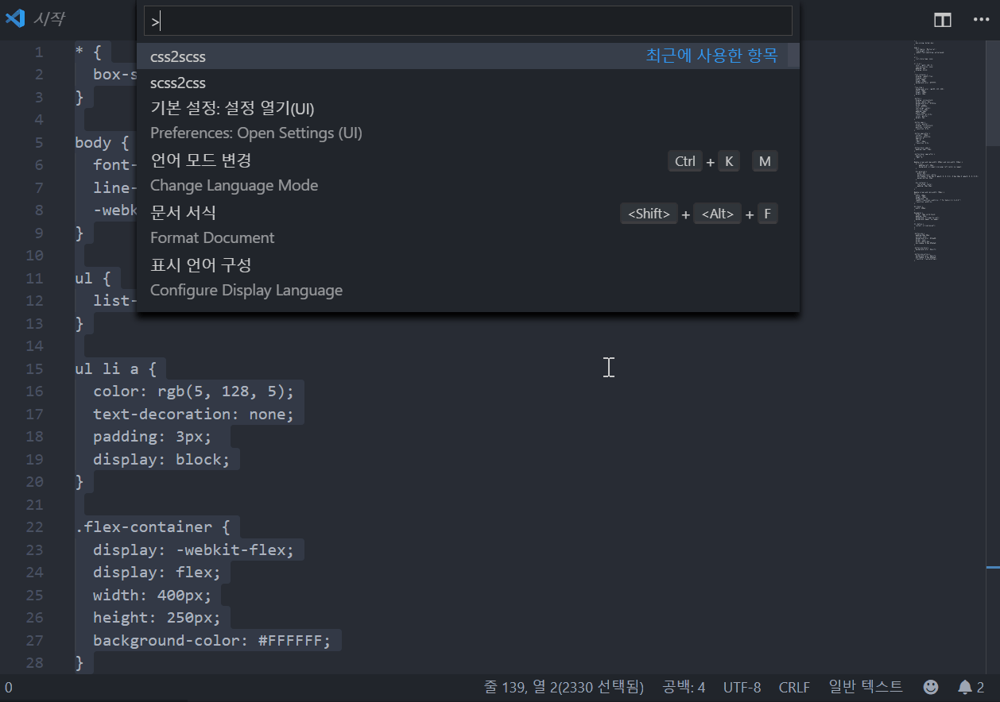

# scss2css

## Features
- scss to css
- css to scss

## Extension Settings

* `scss2css.mode`: `replace`(Replace string) or `new`(Open side view)

## Release Notes

### 0.0.2

Add option `mode`

### 0.0.1

Initial release

-----------------------------------------------------------------------------------------------------------

## ToDo
- [ ] 파일 이름 적용 (filename)
- [ ] 테스트 만들기